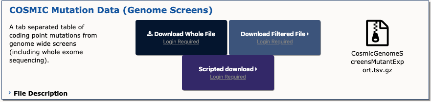

# Cosmic Dataset Adenocarcinoma Characterization
### Characterization of Mutational Processes in Adenocarcinoma Subtypes

Cancer is a disease in which abnormal cellular proliferation metastasizes to other parts of the body. Despite the vast amount of funding funneled into cancer research every year, it remains among the leading causes of human suffering and death in the United States and worldwide. Studying the nature and effect of mutations involved in cancer pathways is a critical aspect of oncology research. Identification of mutations that confer selective advantages to cancer cell populations could guide development of therapeutics that target tumor progression and metastasis. 

Here, we use the publicly-available database COSMIC to study patterns in the genomic information of adenocarcinoma samples from various tissue types in order to identify commonly mutated genes and patterns in mutational processes. We found hits in genes that are known to be associated with cancer processes, as well as yet uncharacterized gene products. While we found no central unifying theme in point mutations across all adenocarcinomas, we identified several common features in certain tissue types that could be attributed to well-supported mutational processes. Further investigation into the genomic patterns we identified may aid development of novel therapeutic approaches to adenocarcinoma and other cancers.

To start, download the entire [COSMIC Mutation Data (Genome Screens)](https://cancer.sanger.ac.uk/cosmic/download). 

.
